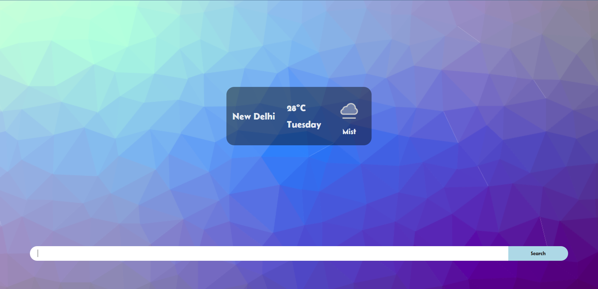

# Weather App

1. A fully responsive app which shows current weather of a place which can be searched.
2. Weather data is fetched with the help of API by [weatherAPI](https://www.weatherapi.com/){target="_blank"}.
3. App is deployed on Netlify and can be visited using the [link](https://get-weather-fast.netlify.app/){target="_blank"}.

App Screenshots:

